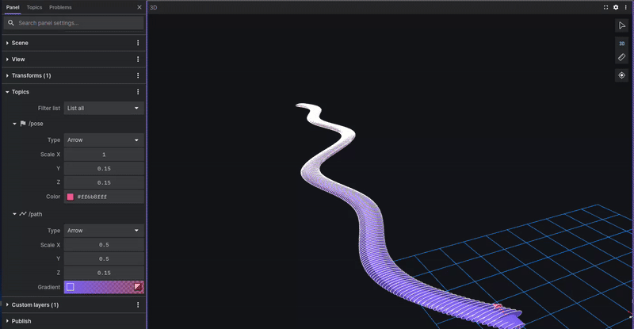

# 🦀 rust_controller

This repository was created as part of a learning journey into the **Rust programming language**, which is increasingly popular in the embedded systems field. Recognized for its performance and memory safety, **Rust is often considered a faster and more efficient alternative to C++**.

---

## 📌 Project Objective

This is a **minimal trajectory tracking controller** for mobile robots, inspired by the `controller_server` component of the [Nav2](https://github.com/ros-planning/navigation2) framework.

The goals of this project are to:
- Apply Rust concepts in a robotics context
- Explore interoperability between **Rust** and the **ROS2 middleware** using the [`rclrs`](https://github.com/ros2-rust/ros2_rust) crate
- Provide a working **Follow path controller** to follow generated trajectories

---

## ⚙️ Features

- Lifecycle-inspired architecture (configure → activate → deactivate...)
- Path types supported: linear, circular, sinusoidal just for example
- Integration with `turtlesim` for basic simulation
- Option to switch between simulated pose and real-time pose feedback

---

## 🚀 Prerequisites

Before building this project, make sure you have:

- **Rust** (stable or nightly)
- **ROS2 Humble** (or any version compatible with `rclrs`)
- **rclrs** (Rust bindings for ROS2):  
  👉 Follow instructions here: https://github.com/ros2-rust/ros2_rust
- `turtlesim` for basic robot simulation:
  ```bash
  sudo apt install ros-humble-turtlesim
  ```

---

## 📦 Installation

1. Clone this repository:
   ```bash
   cd ~/ros_ws/src
   git clone https://github.com/Klein237/rust_controller.git
   ```

2. Build the package with `colcon`:
   ```bash
   cd ~/ros_ws
   source /opt/ros/humble/setup.bash
   colcon build --packages-select rust_controller
   ```

3. Source your environment:
   ```bash
   source install/setup.bash
   ```

---

## 🕹️ Run

### Start `turtlesim`:
```bash
ros2 run turtlesim turtlesim_node
```
### Init the pose
```bash
ros2 service call /turtle1/teleport_absolute turtlesim/srv/TeleportAbsolute "{x: 1.0, y: 1.0, theta: 0.9}"

```
### Launch the wrapper node

```bash
python3 rust_controller/script/wrapper_turtle.py
```


### Launch the controller:
```bash
ros2 run rust_controller rust_controller
```

---

## 🎥 📷 Demos



## 📁 Project Structure

```text
rust_controller/
├── src/
│   ├── main.rs
│   ├── controller_server.rs
│   ├── path_handler.rs
│   └── ...
├── package.xml
├── Cargo.toml
└── README.md
```

---

## 🤝 Contributing

Contributions are welcome!  
Here’s how you can help:

1. Fork the repository
2. Create a branch: `git checkout -b feature/my-feature`
3. Commit your changes: `git commit -am 'Add new feature'`
4. Push to your branch: `git push origin feature/my-feature`
5. Open a **pull request** 📬

---

## 🙏 Acknowledgments

Big thanks to the ROS2 and Rust communities for the amazing tools and libraries.  
This project is also a tribute to all Rust learners starting from scratch — one step at a time 🚶‍♂️

---

## 📜 License

MIT License. See the [LICENSE](./LICENSE) file for details.